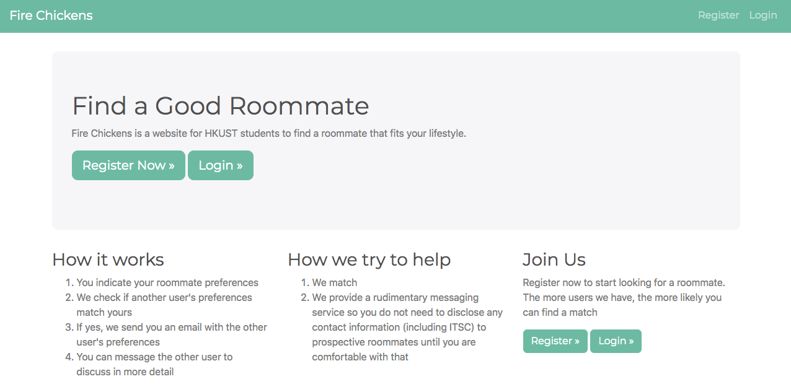
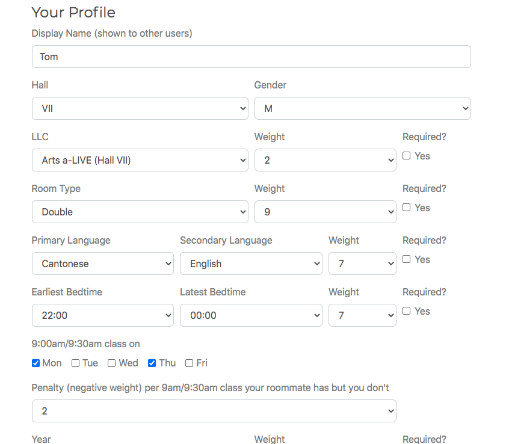

# ust-roomies
A web application for students at HKUST to find roommates with similar lifestyle and routines. This application is a personal project and is not affiliated with HKUST. Uses Django.

## Home page

## Create a profile

## Match with other students
Every night a batch job goes through updated profiles to look for new matches

## View matched students' profiles

## Send them a message
The platform provides a rudimentary messaging system so that users do not need to put their contact information on their profiles. Users get an email whenever they receive a message.

## Running in Prod
1. Create roomies/secrets.py with DJANGO_SECRET_KEY and SEND_GRID_API_KEY
2. Go to roomies/settings.py to:
   1. update DEBUG to False
   2. set CSRF_COOKIE_SECURE to True (uncomment the line near the bottom)
   3. set SESSION_COOKIE_SECURE to True (uncomment the line near the bottom)
3. Consider disabling the route to admin page
4. Consider setting up a more prod-ready database and configure the connection in roomies/settings.py
5. Host static files elsewhere (e.g. Nginx) to reduce server load
  
